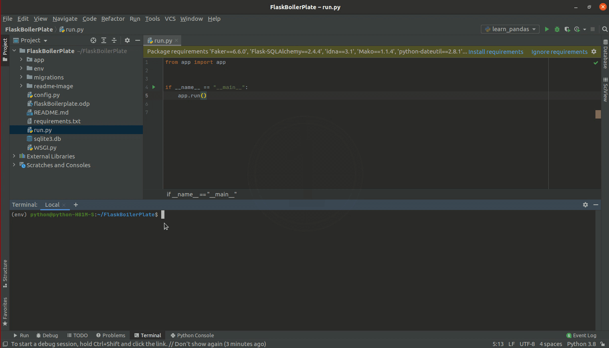

# Flask boilerplate 
<a href="https://travis-ci.org/github/Mindinventory/Python-Project-Structure" style="pointer-events: stroke;" target="_blank">

</a>
<a href="https://travis-ci.org/github/Mindinventory/Python-Project-Structure" style="pointer-events: stroke;" target="_blank">

</a>
<a href="https://docs.python.org/3.8/" style="pointer-events: stroke;" target="_blank">

</a>
<a href="https://pip.pypa.io/en/stable/" style="pointer-events: stroke;" target="_blank">

</a>
<a href="https://flask.palletsprojects.com/en/1.1.x/" style="pointer-events: stroke;" target="_blank">

</a>

```This project will help to build scalable application this includes built-in structured flask boilerplate which supports the latest python versions, and a lot more features like Admin panel,
SMTP configuration, LRF flow(Login and Registration), mail authentication, separate settings file for root project configuration, 
travis integration(CI), alembic (database migrations tool), faker(fake data generator), ORM support(SQLAlchemy), Jinja2 (Template Engine) and it is flexible enough for adding and using other libraries.  
```

## Table of content
- [Standard](#standard)
- [Project Structure](#project-structure)
- [Project Directories](#project-directories)
- [Features](#features)
- [Quick Start](#quick-start)
- [On successful running](#on-successful-running)
## Standard
-If using standard instructions, Python ≥ 3.6 is required.<br/>
-A virtual environment is recommended (like virtualenv==20.4.3).<br/>
-pip is required for installing software packages.<br/>
-It could be easily adapted to run on MySQL or SQLite, but the default installation instructions below assume the use of PostgreSQL.
## Project Structure
```
FlaskBoilerPlate
   ├── app/
   │    ├── api/
   │    │    ├── v1/
   │    │    │    ├── __init__.py
   │    │    │    ├── routes.py 
   │    │    │    └── views.py     
   │    │    └──  __init__.py
   │    ├── auth/   
   │    │    ├── __init__.py
   │    │    ├── forms.py
   │    │    ├── models.py
   │    │    ├── routes.py
   │    │    └── views.py
   │    ├── static/
   │    │    ├── css/
   │    │    ├── img/
   │    │    └── js/
   │    ├── templates/
   │    │    ├── email/
   │    │    ├── errors/
   │    │    ├── forms/ 
   │    │    ├── layouts/
   │    │    └── pages/ 
   │    ├── toolbox/
   │    │    ├── __init__.py 
   │    │    ├── admin.py
   │    │    └── email.py   
   │    ├── __init__.py
   │    └── seeding.py
   ├── env/
   ├── migrations/
   ├── config.py
   ├── requirements.txt
   ├── run.py
   ├── WSGI.py
   └── README.md
```
## Project Directories
### 1 . app
Main project directory where all app are created.This contains following files and folder. 
* #### api
&emsp;&emsp;Contains all api versioning and routes files with signup and login apis.
* #### auth
&emsp;&emsp;Contains basic authentication features like signup, login, forgot password and reset password views. 
* #### static
&emsp;&emsp;Contains the Css, Img and Js files used in your project.
* #### templates
&emsp;&emsp;Contains the HTML templates used in your project.
* #### toolbox
&emsp;&emsp;Contain files for flask admin and sending emails.
* #### init.py
&emsp;&emsp;Main app are register here.
* #### seeding.py
&emsp;&emsp;Seeding file for create fake user.
### 2 . env
Contains environment variables.
### 3 . migrations
Generates automatically when run database migrations command.
### 4 . config.py
Contains whole projects configurations. 
### 5 . requirements.txt
File contains all project dependency.
### 6 . run.py
To run your application.

## Features
* User account sign up, login, password reset, all through asynchronous email confirmation.
* Flask-WTForms for Form generation
* Flask-SQLAlchemy with basic User model
* Easy database migrations with Flask-Migrate
* Flask-Admin for administrative task
* PyJWT for JWT token authentication
* Flask-RESTful for Api versioning
* Bootstrap 4 for starter templates
* itsdangerous for generating random tokens for the confirmation emails.
* Faker used for generating fake user for database

## Quick Start
1. Initialize and activate a virtualenv:
   * for windows
   ```yaml
     virtualenv env
     \path\to\env\Scripts\activate
    ```
   * for linux
   ```yaml  
    sudo apt install python3-venv
    python3 -m venv env
    source env/bin/activate
   ```
2. Install the dependencies:
   ```yaml  
    pip install -r requirements.txt # for windows
    pip3 install -r requirements.txt # for linux
   ```
3. For database configuration in config.py
   ```yaml 
   POSTGRES = {
    'user': 'postgres',
    'pw': 'password',
    'db': 'my_database',
    'host': 'localhost',
    'port': '5432',
    }
   SQLALCHEMY_DATABASE_URI = 'postgresql://%(user)s:\%(pw)s@%(host)s:%(port)s/%(db)s' % POSTGRES 
   ```
4. Run command for database migration:
   ```yaml  
    flask db init
    flask db migrate -m "Initial migration."
    flask db upgrade
   ```
5. Run the development server:
   * for windows
   ```yaml  
    set FLASK_APP=run.py
    set FLASK_ENV=development
    flask run
   ```
   * for linux
   ```yaml  
    export FLASK_APP=run.py
    export FLASK_ENV=development
    flask run
   ```
6. Navigate to http://localhost:5000
   <br/>
   <br/>
7. Generate fake user:
   ```yaml  
    flask seeder --count=n # here n is number of user
   ```
8. SMTP configuration:


## On successful running of the project

